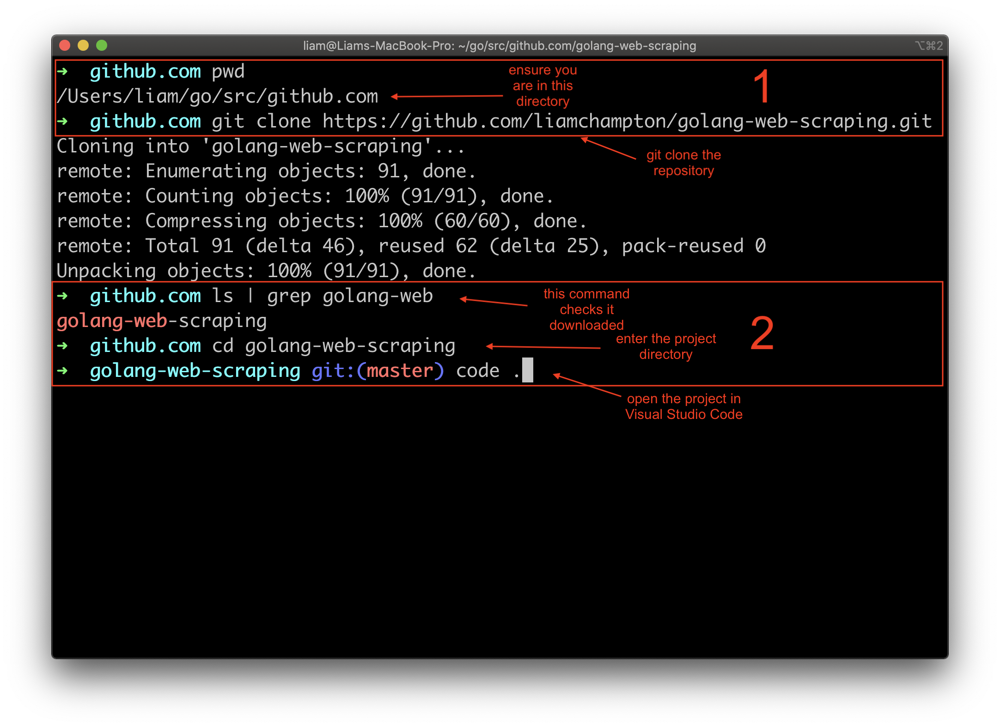

# Lab 1 - Creating a basic Golang Application :books:

In this very first Lab you will clone the repository of the project to make the setup slightly easier and ensure you can run a simple "Hello world" program.

### Step 1

1. Fork this repository to your own personal GitHub account

2. Clone your personal copy of the repository into `$HOME/<user>/go/github.com` on your machine and then open the project in your preferred editor. I use [Visual Studio Code](https://code.visualstudio.com/) with the recommended [Go extension](https://code.visualstudio.com/docs/languages/go) installed from the marketplace.


3. You will be using the Go Modules to manage imports in this workshop so in the terminal, ensure you are in the root of the project directory and initialise it. To do this enter the follow commands:

```bash
go mod init
```

In some cases you may be asked to enter the project directory you wish to initialise. If so, the following _should_ work providing you are following the folder structure outlined in [Lab 0](./lab-0.md) and you have not changed the project name after cloning the repository.

```bash
go mod init github.com/golang-web-scraping
```

### Step 2

Lets start by making a simple `Hello-World` program.

Open the `main.go` file, located in the `cmd` folder and add the code below:

```golang
// Define the package - this will help maintain scope in your application
package main

// Define the fmt import for formatting
import "fmt"

func main() {
    // Print a formatted string to the terminal
    fmt.Println("Hello Fellow Gopher!")
}
```

Save the file and then run it. To do this, navigate to the directory in a new terminal window and use the command `go run cmd/main.go`. This will compile the code and run the program without building a binary (more on this later). The output in the terminal should be `Hello Fellow Gopher!`.

In the next lab we will turn this up a notch and turn your simple `hello world` program into a web server.

Onto [Lab 2](./lab-2.md)
